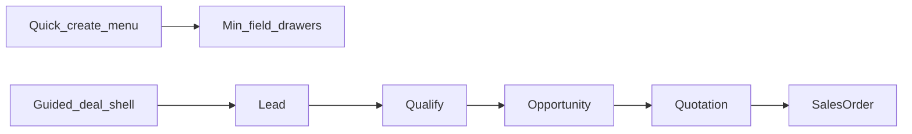
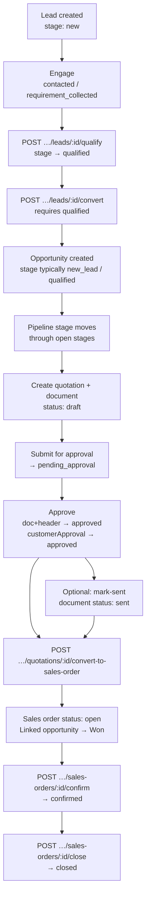
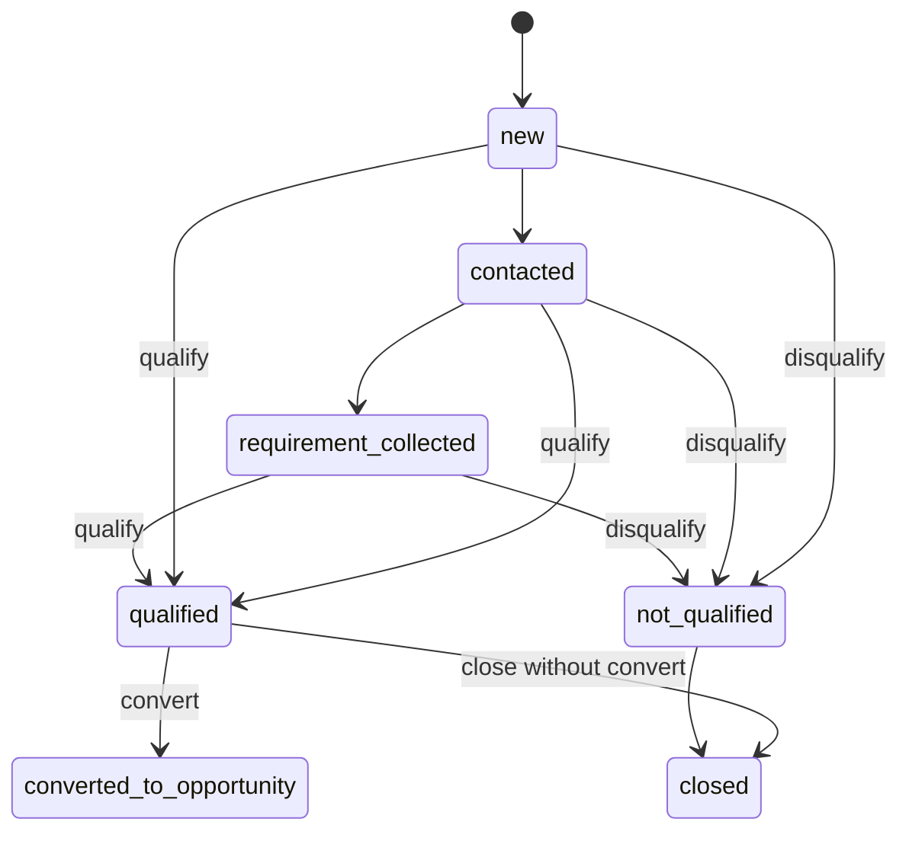
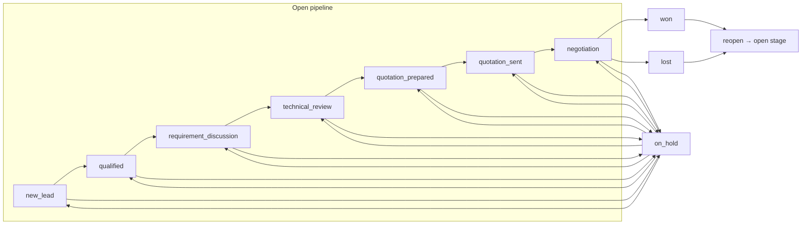
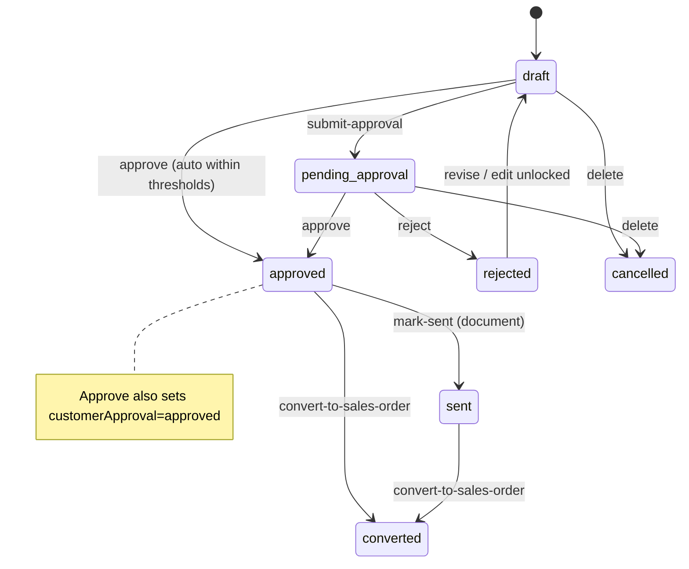
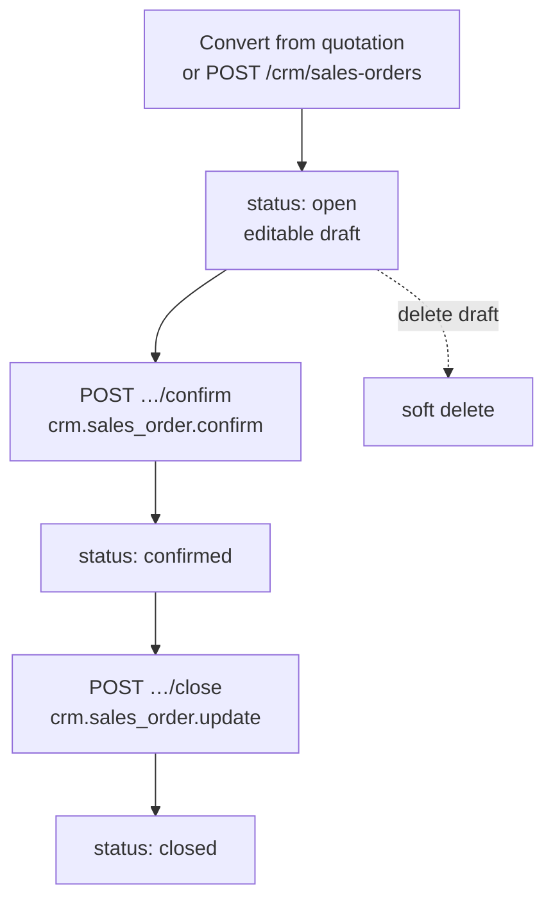
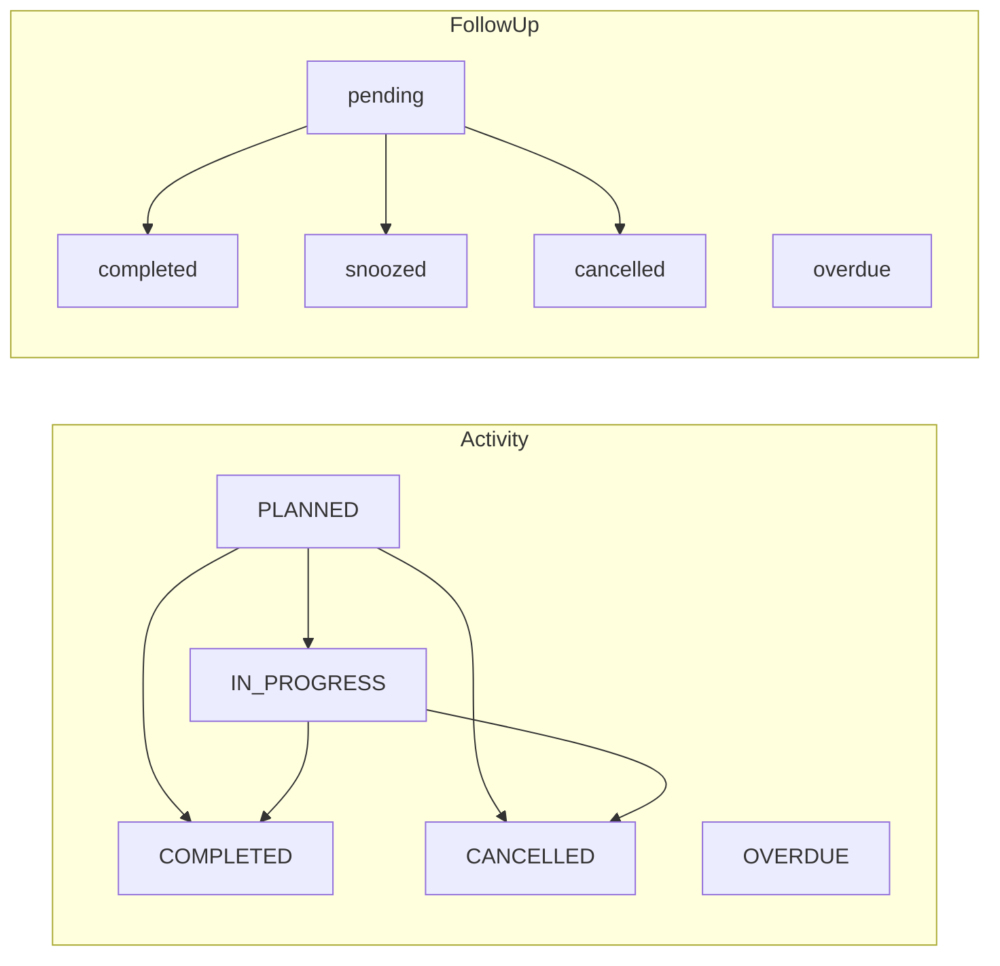

# CRM Commercial Workflow

> Verified against code **2026-07-16**. Diagrams reflect **implemented** CRM Phase 1 behaviour — not aspirational ERP. When this doc and code disagree, **code wins**.  
> Related: [`crm-workflow-map.md`](crm-workflow-map.md) (endpoint guards), [`crm-permission-map.md`](crm-permission-map.md), [`PROJECT_MEMORY.md`](PROJECT_MEMORY.md) (§ CRM commercial funnel).

---

## 1. Executive summary

FOS CRM runs a commercial funnel:

**Lead → Qualify → Convert → Opportunity (pipeline stages) → Quotation (revisions / approval) → Convert to Sales Order → Opportunity Won → SO Confirm → Close.**

**Create UX (2026-07-16):** two modes — neither forces the other.

| Mode | Entry | Intent |
|------|--------|--------|
| **Quick Create** | Suite bar / Topbar **Quick create** | Min-field drawers: Lead, Customer, Opportunity, RFQ, Quotation, Follow-up |
| **Guided Deal** | `/crm/guided-deal` or menu item | Step rail Lead → Qualify → Opportunity → Quote → Order; reuses existing pages/APIs |

**Principle:** capture minimum data first; add commercial/GST/lines when the deal is serious. Conversion gates (qualify before convert; approve before SO) stay for serious transitions. Direct Quotation / Direct SO remain allowed outside Guided Flow.

Alongside the funnel: activities and follow-ups on leads/opportunities/quotations; Lost / On Hold / archive paths; soft-delete. Convert-to-SO is **permission-gated** (`crm.quotation.convert` + `crm.sales_order.create`), not owner-gated. There is **no separate Accept API** — Approve sets `customerApproval=approved` in the same transaction (“Accepted” in product language). SO Phase 1 stops at confirm/close; MRP / dispatch / invoice are deferred.

---

## 2. Happy path (Lead → Sales Order)

**Key rules (code):**

| Step | Guard |
|------|--------|
| Convert lead | Must be qualified (`lead.workflow.assertLeadConvertible`); not already converted |
| Approve quotation | Sets document + quotation `approved` **and** `customerApproval=approved` |
| Convert to SO | Document + quotation `approved`, `customerApproval=approved`, latest revision, validity not past |
| Opportunity on convert | Linked opp stamped **Won** (or SO linked if already Won; blocks Lost / Archived) |
| SO after convert | Created at status **`open`** (UI often calls this “draft”) — not auto-confirmed |

---

## 3. Lead lifecycle

Stages (`LEAD_STAGES` in `backend/.../lead.constants.ts`):

| Stage | Typical meaning |
|-------|-----------------|
| `new` | Default on create |
| `contacted` | Outreach started |
| `requirement_collected` | Need captured |
| `qualified` | Ready to convert |
| `not_qualified` | Disqualified path |
| `converted_to_opportunity` | After convert (terminal for lead funnel) |
| `closed` | Closed without conversion |

Lifecycle status (`LEAD_LIFECYCLE_STATUSES`): `open` → `qualified` → `converted` | `closed`.

Workflow endpoints (not generic PATCH for these): `assign`, `qualify`, `disqualify`, `convert`. See [`crm-workflow-map.md`](crm-workflow-map.md).

---

## 4. Opportunity stage flow

Canonical stages are master-seeded (`opportunity-stages` CRM master) and mirrored in `DEFAULT_PIPELINE_STAGES` / frontend `OPPORTUNITY_STAGES`:

| Slug | Label | Type |
|------|--------|------|
| `new_lead` | New Lead | open |
| `qualified` | Qualified | open |
| `requirement_discussion` | Requirement Discussion | open |
| `technical_review` | Technical Review | open |
| `quotation_prepared` | Quotation Prepared | open |
| `quotation_sent` | Quotation Sent | open |
| `negotiation` | Negotiation | open |
| `won` | Won | closed won |
| `lost` | Lost | closed lost |
| `on_hold` | On Hold | hold |

Backend opportunity **status** enum also includes `ARCHIVED` (API); frontend `OpportunityStatus` is `open | won | lost | on_hold`. Win / lose / reopen use dedicated endpoints (`crm.opportunity.close`).

**Won paths in practice**

1. **Preferred commercial path:** convert approved quotation → SO → linked opportunity auto-Won.  
2. **Manual:** `POST …/opportunities/:id/win` (or stage move to `won` with close permission / UI gates).  
3. **Lost:** `POST …/lose` — lost reason required in UI/API as enforced.

Stage moves on closed Won/Lost are blocked until reopen.

---

## 5. Quotation lifecycle

Two related status spaces:

### Header (`QUOTATION_STATUSES`)

`draft` → `submitted` → `pending_approval` → `approved` | `rejected` → `converted`  
Also: `superseded` (prior revisions), `cancelled` (soft-delete cancels header).

### Document (`QUOTATION_DOCUMENT_STATUSES`)

`draft` | `sent` | `pending_approval` | `approved` | `rejected` | `superseded` | `converted`

### Customer approval (`CUSTOMER_APPROVAL_STATUSES`)

`pending` | `approved` | `rejected` — set on internal Approve/Reject (**no separate Accept endpoint**). Product “Accepted” = header/doc `approved` **and** `customerApproval=approved`.

**Revisions:** `POST …/quotations/:id/revisions` — prior documents become `superseded`; only **latest** approved revision converts.

**Expired:** not a status enum. Convert fails with validation if `validityDate` is before today.

**Send vs convert:** `mark-sent` sets **document** status `sent` (and locks). Convert still requires **approved** + `customerApproval=approved` (Sent shortcut config not implemented).

---

## 6. Sales Order Phase 1

Statuses allowed in API (`SALES_ORDER_STATUSES`):

`open` | `confirmed` | `in_production` | `ready_dispatch` | `dispatched` | `invoiced` | `closed`

**Phase 1 implemented transitions:**

| Status | Phase 1 meaning |
|--------|-----------------|
| `open` | Draft — editable/deletable (`assertDraftEditable`) |
| `confirmed` | Commercial confirm (PO #, terms, grand total &gt; 0 required) |
| `closed` | Closed after confirm |
| `in_production` … `invoiced` | **Present in enum / demo UI chrome; backend fulfilment not implemented** |

Direct SO: `POST /crm/sales-orders` with `source: direct` and required `directSoReason`.

---

## 7. Activities & follow-ups

- **Activities** (Prisma `ActivityStatus`): `PLANNED` | `IN_PROGRESS` | `COMPLETED` | `CANCELLED` | `OVERDUE`; complete via `POST …/activities/:id/complete`.  
- **Follow-ups:** `pending` | `snoozed` | `completed` | `cancelled`; `overdue` is **derived** from due date (repository), not a manual set-only state. Actions: complete / reschedule / snooze.  
- Notes & attachments: `/crm/entities/:entityType/:entityId/…` for COMPANY, CONTACT, LEAD, OPPORTUNITY, ACTIVITY, FOLLOW_UP, QUOTATION.

---

## 8. Permissions (key gates)

Not owner-gated for convert. Detail map: [`crm-permission-map.md`](crm-permission-map.md).

| Action | Permission(s) |
|--------|----------------|
| View leads / opps / quotes / SOs | `crm.lead.view` / `crm.opportunity.view` / `crm.quotation.view` / `crm.sales_order.view` |
| Create lead / opportunity / quotation | `crm.lead.create` / `crm.opportunity.create` / `crm.quotation.create` |
| Qualify / disqualify lead | `crm.lead.qualify` |
| Convert lead → opportunity | `crm.lead.convert` |
| Win / lose / reopen opportunity | `crm.opportunity.close` |
| Submit quotation for approval | `crm.quotation.update` |
| Approve / reject quotation | `crm.quotation.approve` |
| Convert quotation → SO | `crm.quotation.convert` **and** `crm.sales_order.create` |
| Create / update draft SO | `crm.sales_order.create` / `crm.sales_order.update` |
| Confirm SO | `crm.sales_order.confirm` |
| Close SO | `crm.sales_order.update` |
| Activity complete | `crm.activity.complete` |

---

## 9. Where in the UI

Primary SPA routes (canonical under `/crm`; legacy `/sales/leads*`, `/sales/quotations*` redirect):

| Step | Route |
|------|--------|
| CRM dashboard | `/crm` |
| Leads list / new / detail / edit | `/crm/leads`, `/crm/leads/new`, `/crm/leads/:id`, `/crm/leads/:id/edit` |
| Companies / contacts | `/crm/customers`, `/crm/contacts`, `/crm/contacts/:id` |
| Opportunity pipeline / 360 / edit | `/crm/opportunities`, `/crm/opportunities/:id`, `/crm/opportunities/:id/edit` |
| Activities / follow-ups | `/crm/activities`, `/crm/follow-ups` |
| Quotations list / new / 360 | `/crm/quotations`, `/crm/quotations/new`, `/crm/quotations/:id` |
| Quotation editor / preview / print / revisions | `/crm/quotations/:id/editor`, `…/preview`, `…/print`, `…/revisions` |
| Quotation templates | `/crm/quotation-templates` |
| Sales orders list / 360 | `/crm/sales-orders`, `/crm/sales-orders/:id` |
| CRM reports | `/crm/reports`, `/crm/reports/:reportId` |
| Opportunity stages master | `/crm/masters/opportunity-stages` |
| Mobile CRM | `/m/crm`, `/m/crm/leads`, `/m/crm/opportunities`, `/m/crm/quotations`, `/m/crm/sales-orders`, … |

Demo-only sales order screens also exist under `/sales/orders*` (Zustand fulfilment chrome); CRM Phase 1 API work uses `/crm/sales-orders*`.

---

## 10. Out of scope / deferred

| Area | Status |
|------|--------|
| Purchase, inventory, production, quality, finance backends | Deferred by design (demo FE may exist) |
| SO MRP / production / ready_dispatch / dispatched / invoice posting | Deferred — enum values exist; Phase 1 API only open → confirm → close |
| Separate quotation “Accept” API | Not implemented — Approve sets customer approval |
| Convert from Sent without Approve | Not implemented (company config shortcut absent) |
| Quotation status `expired` | Not an enum — validity checked at convert |
| Accounting posting from SO | Demo / scaffolding only |
| Owner-only convert | Not used — RBAC permissions only |

---

## Source references

| Concern | Location |
|---------|----------|
| Lead stages / lifecycle | `backend/src/modules/crm/leads/lead.constants.ts`, `lead.workflow.ts` |
| Opportunity stages seed | `backend/src/modules/crm/masters/crm-master.seed-data.ts`, `permissions.ts` `DEFAULT_PIPELINE_STAGES` |
| FE stage labels | `frontend/src/types/crm.ts` `OPPORTUNITY_STAGES` |
| Quotation statuses | `backend/.../quotation.constants.ts`, `frontend/src/types/quotation.ts` |
| Convert / Accepted rules | `backend/.../quotation.convert.ts`, Swagger notes in `backend/src/config/swagger.ts` |
| SO Phase 1 | `backend/.../sales-orders/sales-order.workflow.ts` |
| Routes | `frontend/src/routes/crmRoutes.tsx`, `quotationRoutes.tsx` |
