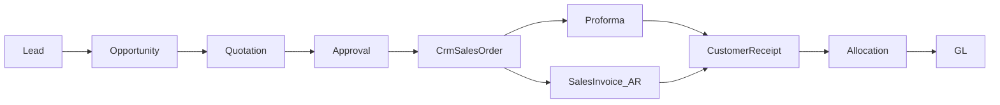

# Kology Service-Business Reuse Audit

> Verified against code: **2026-07-27**  
> Gate for Phases K1–K6. **No forks** — reuse CRM / Sales / Accounting.

**Principles:** `businessType = SERVICES` + `TenantModuleFlag` + permissions + nav. Never `if (tenantSlug === 'kology')`.

---

## Canonical decisions (locked from audit)

| Decision | Choice |
|----------|--------|
| Customer invoice SoT | **Accounting `SalesInvoice`** (Money In) — posts GL / AR |
| Not SoT for books | CRM `CrmTaxInvoice` — hide for SERVICES nav (keep code) |
| Proforma | `CrmProformaInvoice` — optional advance doc; wire receipts via Money In |
| Line master | **`MasterItem`** with `itemType = service` + `defaultFulfilmentMethod = SERVICE` |
| Do not create | `KologyService` table |
| Product master | Engineering/manufacturing — **hide** for SERVICES |
| Tenant packaging | New `Tenant.businessType` (`MANUFACTURING` \| `SERVICES`) |
| Module ON | `crm`, `accounting`, `masters`, `reports` |
| Module OFF | `purchase`, `inventory`, `manufacturing`, `quality`, `dispatch`, `logistics`, `gate` |
| Sales nav key | Aliases to `crm` (no separate catalog key) |
| Bank & Cash | Under `accounting` (no separate flag) |

---

## Known risks resolved

1. **Dual invoices** — Prefer Money In SI; hide CRM tax invoices + CRM payment allocation for SERVICES.
2. **productId vs itemId** — BE is `itemId`-only; FE still has product leftovers → clean labels/selectors in K3.
3. **SO 360** — Production / Dispatch / Reservations panels → hide when manufacturing/inventory/dispatch off.
4. **No businessType** — add in K1.
5. **Module catalog** — no `sales` / `bank_cash` keys; SERVICES pack as above.
6. **Expenses** — no staff-expense module; use Money Out vendor bill `EXPENSE` + paid journal path (K5).
7. **canRoute gap** — permissions ignore module flags; harden in K1.
8. **P&L/BS** — live FS incomplete; use ledger / period-close TB for UAT; no revive of demo FS this phase.

---

## 1. CRM

| Capability | Route(s) | FE | API | DB | Reuse | Adapt | Hide | Dup risk |
|------------|----------|----|-----|-----|-------|-------|------|----------|
| Companies | `/crm/companies`, `/entity360/customers/:id` | `CrmEntityPages`, `Customer360Page` | `/crm/companies` | `CrmCompany` | Yes | 360 money strip → AR APIs | — | Low |
| Contacts | `/crm/contacts*` | `CrmContactFormPage`, `Contact360Page` | `/crm/contacts` | `CrmContact` | Yes | — | — | Low |
| Leads | `/crm/leads*` | `CrmLeadListPage`, `CrmLeadFormPage` | `/crm/leads` + lifecycle | `CrmLead` | Yes | Service language | IndiaMart | Low |
| Opportunities | `/crm/opportunities*` | `OpportunityPages`, `Opportunity360Page` | `/crm/opportunities` | `CrmOpportunity`, `CrmOpportunityLine` | Yes | itemId / Service labels | — | FE productId |
| Activities | `/crm/opportunities?view=activities` | `CrmEngagementPanels` | `/crm/activities` | `CrmActivity` | Yes | — | — | Low |
| Follow-ups | `?view=follow-ups` | `CrmFollowUpsPanel` | `/crm/follow-ups` | `CrmFollowUp` | Yes | — | — | Low |
| Notes | Embedded | `EntityNotesPanel` | `/crm/entities/…/notes` | `CrmNote` | Yes | — | — | Low |
| Attachments | Embedded | `EntityAttachmentsPanel` | `/crm/entities/…/attachments` | `CrmAttachment` | Yes | — | — | Low |
| Quotations | `/crm/quotations*` | `QuotationCrmPages`, `Quotation360Page` | `/crm/quotations` | `CrmQuotation`, `CrmQuotationDocument` | Yes | Service lines/templates | Trailer templates | Medium |
| Templates | `/crm/quotation-templates*` | Template pages | `/crm/quotation-templates` | `CrmQuotationTemplate` | Partial | Seed service templates | Trailer packs | Medium |
| Approval | Quotation UI | `QuotationApprovalPanel` | document submit/approve | Status + `approvalHistory` JSON | Yes | Policy thresholds for Kology | — | Low — not a separate engine |
| Convert→SO | Quotation action | `useQuotationConversion` | `POST …/convert-to-sales-order` | → `CrmSalesOrder` | Yes | No mfg demand after convert | — | Low |
| Dashboard | `/crm` | `CrmDashboardPage` | `GET /crm/dashboard/metrics` | Aggregates | Yes | KPI copy | — | Low |
| Reports | `/crm/reports*` | `CrmReportsPages` | `GET /crm/reports` | Query | Yes | — | — | Low |
| Search | Shell GlobalSearch | `useCrmGlobalSearch` | `GET /crm/search` | Multi | Yes | — | — | Low |

**Approval engine:** `quotation.service.ts` + `quotation.constants.ts` (not a microservice).  
**Convert:** `backend/src/modules/crm/quotations/quotation.convert.ts`.

---

## 2. Sales

| Area | Route(s) | FE | API | DB | Notes |
|------|----------|----|-----|-----|-------|
| SO list/360 | `/crm/sales-orders*`, `/sales/orders*` | `SalesOrder360Page`, list pages | `/crm/sales-orders` confirm/close | `CrmSalesOrder` (lines JSON) | API status: open→confirmed→closed |
| Direct SO | `/sales/orders/new` | Create chooser | `POST` source=direct | `source`, `directSoReason` | Keep for SERVICES |
| Proforma | `/sales/proforma-invoices*` | Proforma pages | `/crm/commercial/proformas` | `CrmProformaInvoice` | Optional |
| CRM tax invoice | `/sales/invoices*` | Commercial invoice pages | `/crm/commercial/invoices` | `CrmTaxInvoice` | **Hide** — no GL |
| AR invoice | `/accounting/money-in/invoices*` | Money In | Accounting AR APIs | `SalesInvoice` + source links | **Canonical** |
| SO 360 panels | tabs | Production / Dispatch / Reservations | — | stores | **Hide** when modules off |

---

## 3. Accounting

| Area | Route prefix | Reuse | Adapt |
|------|--------------|-------|-------|
| Sales Invoice AR | `/accounting/money-in/invoices*` | Yes | SO→SI without dispatch |
| Receipts / allocation / CN | `/accounting/money-in/receipts*`, credit-notes | Yes | — |
| Money Out / Vendor bills | `/accounting/money-out/*` | Yes | SERVICE/EXPENSE types |
| Expenses UX | — | Wrap VI EXPENSE + paid path | Build simple entry (K5) |
| Journals / GL | `/accounting/entries/journals*`, ledger | Yes | — |
| P&L / BS | Incomplete live FS | Use TB / ledger for UAT | Deferred full FS |
| Bank & Cash | `/accounting/bank-cash/**` | Yes | — |

---

## 4. Module flags & nav

| Piece | Path |
|-------|------|
| Catalog | `backend/src/modules/modules/module-catalog.ts` |
| DB | `TenantModuleFlag` |
| Admin UI | `/admin/modules` → `AdminModulesPage` |
| Sidebar | `isModuleEnabled` in `Sidebar.tsx` |
| Gap | `canRoute` / most APIs ignore flags — fix in K1 |

---

## 5. Masters (Service)

| Model | Verdict |
|-------|---------|
| `MasterItem` | **Reuse** — `itemType=service`, fulfilment SERVICE, sales rate, HSN/SAC string, non-stockable |
| `MasterProduct` | **Hide** for SERVICES (trailer-shaped) |
| Billing types | Gap — store in item `details` JSON or minimal column in K3; avoid new table |
| Required attrs | Code, Name, Category, Description, Billing Type, Rate, Currency, Tax/SAC, Revenue Account, Payment Terms, Active — extend minimally |

---

## 6. Admin

| Area | Status |
|------|--------|
| Permissions | Reuse `crm.*` / `finance.*` — seed Kology role packs |
| Quotation approval | Permission + thresholds; configure for tenant |
| Finance approval rules | Existing LE-scoped rules |
| Number series | CRM CodeSeries + FinanceNumberSeries |
| Terminology | **Missing** — add display config in K1 |

---

## Implementation implications

| Phase | Action |
|-------|--------|
| K1 | `businessType`, seed `kology`, flags, nav/canRoute, terminology |
| K2 | CRM funnel verify + approval policy seed |
| K3 | Service items + labels; hide SO mfg panels; invoiceability strip |
| K4 | SO→AR SI (partial/block over); hide CRM tax/receipt nav; Company 360 AR |
| K5 | Expense UX → Money Out; CoA seed; Bank pay |
| K6 | Golden-path UAT + docs |

---

*End of audit.*
