# CRM Master Relationship Map

## Entity Relationship Overview

```mermaid
erDiagram
    CRM_MASTERS_HUB ||--o{ CATALOG_MASTER : contains
    CRM_MASTERS_HUB ||--o{ LINKED_MASTER : bridges

    CATALOG_MASTER ||--o{ CRM_MASTER_ENTRY : stores

    COMPANY ||--o{ CONTACT : has
    COMPANY }o--|| INDUSTRY : classified_by
    COMPANY }o--|| TERRITORY : assigned_to
    COMPANY }o--o| LEAD_SOURCE : sourced_from

    LEAD }o--|| LEAD_STAGE : in_stage
    LEAD }o--|| LEAD_PRIORITY : has_priority
    LEAD }o--|| LEAD_SOURCE : from_source
    LEAD }o--|| INDUSTRY : in_industry
    LEAD }o--|| OWNER : owned_by
    LEAD }o--o| LEAD_REASON : closed_reason

    OPPORTUNITY }o--|| OPPORTUNITY_STAGE : in_stage
    OPPORTUNITY }o--|| OPPORTUNITY_PRIORITY : has_priority
    OPPORTUNITY }o--|| OWNER : owned_by
    OPPORTUNITY }o--o| LOST_REASON : lost_reason
    OPPORTUNITY }o--o| COMPETITOR : lost_to

    QUOTATION }o--|| PAYMENT_TERM : payment
    QUOTATION }o--|| DELIVERY_TERM : delivery
    QUOTATION }o--|| WARRANTY_TERM : warranty
    QUOTATION }o--o{ COMMERCIAL_TERM : clauses
    QUOTATION }o--o| PRODUCT_INTEREST : product
    QUOTATION }o--o| QUOTATION_TEMPLATE : layout

    ACTIVITY }o--|| ACTIVITY_TYPE : typed
    FOLLOW_UP }o--|| FOLLOW_UP_TYPE : typed

    APPROVAL_RULE ||--o{ QUOTATION : governs
    DOCUMENT_TYPE ||--o{ ATTACHMENT : classifies
```



---

## Master → Transaction Consumption

| Master Kind | Leads | Opportunities | Quotations | SO | Companies | Contacts | Reports |
|-------------|:-----:|:-------------:|:----------:|:--:|:---------:|:--------:|:-------:|
| lead-sources | ✅ | — | — | — | ✅ | — | ✅ |
| industries | ✅ | — | — | — | ✅ | — | ✅ |
| territories | — | — | — | — | ✅ | — | ✅ |
| owners | ✅ | ✅ | — | — | — | — | ✅ |
| lead-stages | ✅ | — | — | — | — | — | ✅ |
| lead-priorities | ✅ | — | — | — | — | — | ✅ |
| lead-reasons | ✅ | — | — | — | — | — | ✅ |
| opportunity-stages | — | 🔶 | — | — | — | — | ✅ |
| opportunity-priorities | — | 🔶 | — | — | — | — | ✅ |
| competitors | — | 🔶 | — | — | — | — | ✅ |
| lost-reasons | — | 🔶 | — | — | — | — | ✅ |
| activity-types | 🔶 | 🔶 | — | — | — | — | — |
| follow-up-types | ✅ | ✅ | 🔶 | — | — | — | — |
| product-interests | 🔶 | 🔶 | 🔶 | — | — | — | ✅ |
| commercial-terms | — | — | 🔶 | 🔶 | — | — | — |
| payment-terms | — | — | 🔶 | 🔶 | ✅ | — | — |
| delivery-terms | — | — | 🔶 | 🔶 | — | — | — |
| warranty-terms | — | — | 🔶 | — | — | — | — |
| approval-rules | — | — | 🔶 | 🔶 | — | — | — |
| document-types | 🔶 | 🔶 | 🔶 | 🔶 | — | — | — |

✅ = Wired in production UI  
🔶 = Master exists; consumption planned or partial

---

## Usage Link Navigation

When a master record is in use, the detail page shows **live usage links** that navigate to filtered CRM registers:

| Master | Filter Parameter | Target Route |
|--------|------------------|--------------|
| lead-stages | `?stage=` | `/crm/leads` |
| lead-priorities | `?priority=` | `/crm/leads` |
| lead-sources | `?source=` | `/crm/leads` |
| industries | `?industry=` | `/crm/leads`, `/crm/customers` |
| owners | `?owner=` | `/crm/leads`, `/crm/opportunities` |
| territories | `?territory=` | `/crm/customers` |
| opportunity-stages | `?stage=` | `/crm/opportunities` |
| lost-reasons | `?lostReason=` | `/crm/opportunities` |
| follow-up-types | `?followUpType=` | `/crm/leads` |

---

## Delete / Deactivate Cascade Rules

```
IF systemControlled = true
  → BLOCK delete, deactivate, code change

ELSE IF countMasterUsage(entry) > 0
  → BLOCK delete
  → ALLOW deactivate (existing records retain value)

ELSE
  → ALLOW delete
```

---

## Hub Card → Register Mapping

| Hub Card | Storage | Count Source |
|----------|---------|--------------|
| Company Master | `masterStore.customers` | `customers.length` |
| Contact Master | `crmStore.contacts` | `contacts.length` |
| Quotation Template | `crmStore.quotationTemplates` | `templates.length` |
| All catalog masters | `crmMasterStore.entries` | `filter by kind` |

---

## Data Flow: Lead Creation

```
1. User opens /crm/leads/new
2. Lead form loads:
   - useLeadStageOptions() → lead-stages (active)
   - useLeadPriorityOptions() → lead-priorities
   - useFollowUpTypeOptions() → follow-up-types
   - getActiveLeadUsers() → owners
3. Company selection pulls industry/source from customer record
4. On save, lead.stage = master code (not display name)
5. countMasterUsage() increments for referenced masters
```

---

## Persistence Boundaries

| Store | Persists | Reset on Demo |
|-------|----------|---------------|
| crmMasterStore | Yes (localStorage) | No |
| crmStore | Yes | Yes |
| masterStore | Yes | Yes |
| salesStore (leads) | Yes | Yes |

CRM Masters survive demo baseline reset to preserve administrator configuration.
