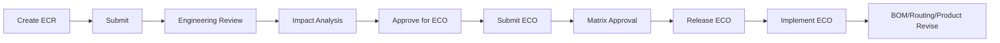

# ECO / ECR Completion Report — Sprint 3

**Project:** Vasant ERP (`trailer-erp`)  
**Sprint:** Engineering Change Control (ECO / ECR)  
**Date:** June 2026  
**Status:** ✅ Complete — formal ECR → ECO workflow with impact analysis, approval matrix integration, and BOM/routing revise on implement

---

## Executive Summary

Factory Control Sprint 3 delivers a **formal Engineering Change Control** module replacing ad-hoc BOM/routing revisions. The workflow covers Engineering Change Requests (ECR) through Engineering Change Orders (ECO), with impact analysis, matrix-driven approval, release, and automatic BOM/routing/product revision on implementation.

| Area | Before | After |
|------|--------|-------|
| Engineering change workflow | Manual BOM/routing revise only | Full ECR → Review → Impact → ECO → Approval → Release → Implement |
| Change register | Legacy mock in unwired `EngineeringPage.tsx` | Live register at `/engineering/eco` |
| Impact analysis | None | Open SO/WO/PO/PR, inventory, cost sheets |
| Released BOM/routing guard | None | `assertEcoRequiredForBom` / `assertEcoRequiredForRouting` helpers |
| Approval | Hardcoded or absent | `engineering_change` document type via approval matrix |
| Tests | None | **12/12** `test:eco-ecr` |
| CI gate | Excluded | Included in `test:factory-control` + `test:ci` |

**Test result (verified 23 Jun 2026):** `npm run test:eco-ecr` — **12/12 passed**

---

## Goal

Introduce governed engineering change control without altering existing ERP transaction flows. Released BOMs and routings must be revised through an ECR/ECO path; implementation triggers standard `reviseBom()` / `reviseRouting()` / product revision helpers already used elsewhere in the system.

---

## What Was Completed

### 1. Domain Types ✅

**File:** `src/types/engineeringChange.ts`

| Type | Purpose |
|------|---------|
| `EngineeringChangeRequest` | ECR header — change type, product/BOM/routing refs, reason, priority, status |
| `EngineeringChangeOrder` | ECO header — linked ECR, effective date, affected entities, cost impact, approval status |
| `EcoImpactAnalysis` | Structured impact snapshot for review UI |
| `EcrStatus` | `draft` → `submitted` → `under_review` → `impact_analysis` → `approved_for_eco` (+ rejected/cancelled) |
| `EcoStatus` | `draft` → `pending_approval` → `approved` → `released` → `implemented` (+ closed/rejected) |
| `EcrChangeType` | `product`, `bom`, `routing`, `item`, `process`, `cost` |

---

### 2. ECO Store & Business Rules ✅

**File:** `src/store/ecoStore.ts`  
**Persistence:** `ERP_STORAGE_KEYS.eco` via Zustand persist

| Action | Permission | Description |
|--------|------------|-------------|
| `createEcr` | `engineering.create` | Generates `ECR-` document number |
| `submitEcr` | `engineering.edit` | Draft → submitted |
| `startEngineeringReview` | `engineering.approve` | Submitted → under_review |
| `completeImpactAnalysis` | `engineering.approve` | Under review → impact_analysis |
| `approveEcrForEco` | `engineering.approve` | Creates linked ECO (draft), ECR → approved_for_eco |
| `submitEcoForApproval` | `engineering.edit` | Syncs approval request to matrix |
| `approveEco` | `engineering.approve` | Matrix check + step advance → approved |
| `releaseEco` | `engineering.release` | Approved → released (effective date gate) |
| `implementEco` | `engineering.post` | Triggers BOM/routing/product revise → implemented |

**Impact analysis** (`computeImpactAnalysis`):
- Affected products and BOMs (scoped by ECR product/BOM when set)
- Open sales orders and work orders (with BOM revision on WO)
- Open purchase orders and requisitions
- Inventory free qty snapshot (top 20 items)
- Product cost sheets (standard cost)

**Edit guards** (exported helpers):
- `assertEcoRequiredForBom(bomId)` — blocks direct edit when BOM status is `released` or `approved`
- `assertEcoRequiredForRouting(routingId)` — blocks direct edit when routing status is `released`
- `requiresEcoForBomEdit` / `requiresEcoForRoutingEdit` — boolean checks used in tests

**Implement side-effects** (no change to core revise logic):
- `bomStore.reviseBom(affectedBomId)` when BOM is released/approved
- `routingStore.reviseRouting(affectedRoutingId)` when routing is released
- `productStore.createProductRevision()` with reason `ECO {ecoNo} implementation`

---

### 3. UI Pages & Routes ✅

**File:** `src/modules/engineering/EcoPages.tsx`  
**Routes:** `src/routes/index.tsx`

| Route | Page | Description |
|-------|------|-------------|
| `/engineering/eco` | `EcoRegisterPage` | ECR + ECO register (DataGrid) |
| `/engineering/eco/new` | `EcoNewPage` | Create ECR form |
| `/engineering/eco/:id` | `EcoDetailPage` | Workflow actions + impact panels |

**Detail page workflow buttons** (status-gated):
1. Submit ECR
2. Start Review
3. Complete Impact Analysis
4. Approve for ECO
5. Submit ECO for Approval
6. Approve ECO
7. Release ECO
8. Implement ECO

**Impact panels on detail:** Open Work Orders, Open Sales Orders, BOMs, Open POs

**RBAC:** `PermissionGate` on "New ECR" (`engineering.create`); store-level `assertPermission` on all mutations

**Legacy:** `EngineeringPage.tsx` + `src/data/engineering.ts` static seed remain unwired — superseded by `EcoPages.tsx`

---

### 4. Approval Matrix Integration ✅

**Document type:** `engineering_change` (`src/types/approvalMatrix.ts`)

**Seed rules** (`src/data/approval/seedApprovalMatrix.ts`):

| Rule | Condition | Approver |
|------|-----------|----------|
| ECO approval | `isRevision = true` | Engineering Head |
| ECO cost impact above ₹10 Lakh | `totalAmount > 1,000,000` | Director |

**Flow:**
- `submitEcoForApproval` → `syncApprovalRequest({ documentType: 'engineering_change', ... })`
- `approveEco` → `assertMatrixApproval` + `advanceApprovalStep` (reusable engine — no hardcoded approvers in UI)

---

### 5. Route Protection ✅

**File:** `src/config/permissionMatrix.ts`

- Route prefix `/engineering` → `engineering.view`
- Engineering role: full module access (`view`, `create`, `edit`, `approve`, `release`, `post`)
- Other roles: read-only or scoped per role matrix

---

### 6. Engineering Change Report ✅ (existing, product changeLog)

**Route:** `/reports/products/engineering-change`  
**File:** `src/utils/productReports.ts` → `getEngineeringChangeReport()`

Shows product master `changeLog` entries (field, old/new value, user, reason). ECO implementation writes to product revision change log via `createProductRevision`.

> **Note:** Report is product-field oriented, not a dedicated ECR/ECO register export. ECR/ECO audit trail lives in `ecoStore` and the `/engineering/eco` register.

---

### 7. Automated Tests ✅

**Script:** `scripts/test-eco-ecr.ts`  
**Command:** `npm run test:eco-ecr`

| # | Test | Validates |
|---|------|-----------|
| 1 | Create ECR | Document number, store persist |
| 2 | Submit ECR | Status transition |
| 3 | Start engineering review | Review gate |
| 4 | Complete impact analysis | Impact phase |
| 5 | Approve ECR for ECO | ECO creation + link |
| 6 | Impact analysis returns open WO list | Cross-store read |
| 7 | Submit ECO for approval | Matrix request sync |
| 8 | Approve ECO via matrix | Engineering head + director path |
| 9 | Release ECO | Release gate |
| 10 | Implement ECO | BOM revise trigger |
| 11 | ECO status implemented | Final status |
| 12 | Released BOM requires ECO for edit | Guard helper |

**CI inclusion:**
- `test:factory-control` — includes `test:eco-ecr`
- `test:ci` via `scripts/run-ci.ts` — suite label **ECO / ECR** (12/12)

---

## Workflow Diagram

---

## File Inventory

| File | Role |
|------|------|
| `src/types/engineeringChange.ts` | ECR/ECO types and impact shape |
| `src/store/ecoStore.ts` | Workflow, impact analysis, guards, implement |
| `src/modules/engineering/EcoPages.tsx` | Register, new ECR, detail UI |
| `src/routes/index.tsx` | Route wiring |
| `src/data/approval/seedApprovalMatrix.ts` | ECO approval rules |
| `src/types/approvalMatrix.ts` | `engineering_change` document type |
| `src/config/permissionMatrix.ts` | Engineering RBAC |
| `scripts/test-eco-ecr.ts` | 12 automated checks |
| `scripts/run-ci.ts` | CI gate entry |

**Related (unchanged, called on implement):**
- `src/store/bomStore.ts` — `reviseBom()`
- `src/store/routingStore.ts` — `reviseRouting()`
- `src/store/productMasterStore.ts` — `createProductRevision()`

---

## Acceptance Criteria

| Criterion | Status |
|-----------|--------|
| ECR can be created, submitted, reviewed | ✅ |
| Impact analysis shows open WO/SO and related entities | ✅ |
| ECO created from approved ECR | ✅ |
| ECO requires matrix approval before release | ✅ |
| Implement ECO revises released BOM/routing | ✅ |
| Released BOM flagged as requiring ECO for direct edit | ✅ |
| Routes accessible under `/engineering/eco` | ✅ |
| RBAC permissions enforced on store actions | ✅ |
| 12/12 automated tests pass | ✅ |
| Included in CI gate | ✅ |

---

## Constraints Honoured

- ✅ No changes to core GRN, WO, dispatch, or QC transaction flows
- ✅ BOM/routing revise uses existing store methods (not duplicated logic)
- ✅ Approval logic delegated to reusable `approvalEngine` (not hardcoded in pages)
- ✅ Legacy engineering demo page left in place but not routed

---

## Remaining (P2 — not blocking go-live for factory-control core)

| Item | Notes |
|------|-------|
| Wire `assertEcoRequiredForBom` / `assertEcoRequiredForRouting` into BOM and routing edit store actions and UI error surfaces | Helpers exist; not yet called from `bomStore` / `routingStore` edit paths |
| ECR/ECO rows in Engineering Change Report | Report currently shows product `changeLog` only |
| Cost impact entry on ECO form | `costImpact` defaults to 0; director rule seeded but UI does not capture amount |
| Effectivity enforcement at WO creation | WO does not yet block creation against obsolete BOM revision |
| DMS revision tag sync on ECO implement | Document management hardening is separate sprint |
| Remove or archive legacy `EngineeringPage.tsx` / `data/engineering.ts` | Low priority — already unwired |

---

## Manual Verification Checklist

1. Navigate to **Engineering → ECO Register** (`/engineering/eco`)
2. Create new ECR with BOM change type and reason
3. Walk through Submit → Review → Impact Analysis → Approve for ECO
4. Confirm impact panels show open WO/SO counts
5. Submit ECO → Approve (as Engineering Head / Admin) → Release → Implement
6. Verify new draft BOM revision created for affected released BOM
7. Confirm `requiresEcoForBomEdit` returns true for original released BOM

---

*Generated after Sprint 3 ECO/ECR implementation and CI verification.*
