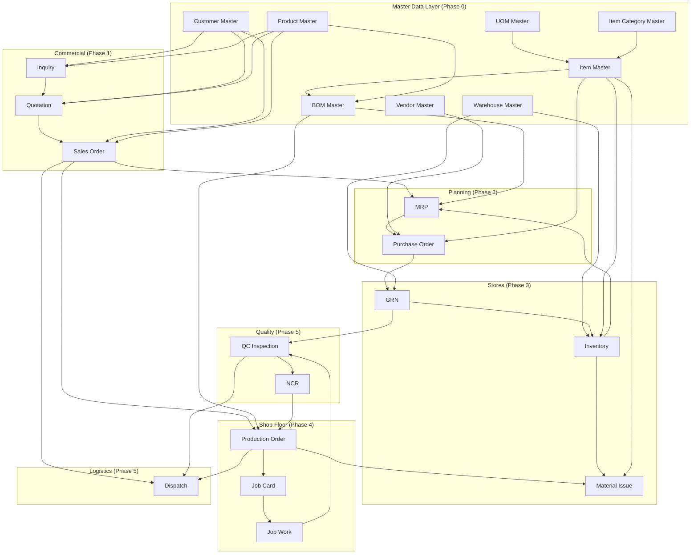

# Vasant Trailer ERP — Module Dependency Map

**Document Version:** 2.0 — Foundation  
**Status:** Pre-development architecture  

---

## 1. Full Process Flow

```
INQUIRY → QUOTATION → SALES ORDER → BOM → MRP → PURCHASE → GRN →
INVENTORY → MATERIAL ISSUE → PRODUCTION ORDER → JOB CARD →
JOB WORK → QC → DISPATCH
```

Each arrow represents a hard dependency — downstream module cannot function without upstream output.

---

## 2. Master Data Dependency Chain

```
┌─────────────┐
│ UOM Master  │  Step 1 — no dependencies
└──────┬──────┘
       ▼
┌─────────────────────┐
│ Item Category Master│  Step 2 — no dependencies
└──────┬──────────────┘
       ▼
┌─────────────┐
│ Item Master │  Step 3 — depends on UOM + Category
└──────┬──────┘
       │
       ├──────────────────────────────────────┐
       ▼                                      ▼
┌─────────────────┐                  ┌─────────────────┐
│ Customer Master │  Step 4            │ Vendor Master   │  Step 5
└─────────────────┘                  └────────┬────────┘
                                              │
       ┌──────────────────────────────────────┘
       ▼
┌──────────────────┐
│ Warehouse Master │  Step 6
└────────┬─────────┘
         ▼
┌─────────────────┐
│ Product Master  │  Step 7 — depends on UOM
└────────┬────────┘
         ▼
┌─────────────┐
│ BOM Master  │  Step 8 — depends on Item Master + Product Master
└─────────────┘
         │
         ▼
   [Transactional Modules]
```

> **Gate:** BOM Master module is locked until Item Master AND Product Master validation passes.

---

## 3. Module Dependency Graph (All Modules)



---

## 4. Dependency Matrix

**Legend:** R = Reads · W = Writes · T = Triggers · — = None

| Module ↓ / → | UOM | Cat | Item | Cust | Vend | WH | Prod | BOM | Inq | Quo | SO | MRP | PO | GRN | Inv | MI | ProdOrd | JC | JW | QC | DSP |
|--------------|-----|-----|------|------|------|----|----- |-----|-----|-----|----|-----|----|-----|-----|----|---------|----|----|----|-----|
| Item Master | R | R | W | — | — | — | — | — | — | — | — | — | — | — | — | — | — | — | — | — | — |
| BOM Master | R | — | R | — | — | — | R | W | — | — | — | — | — | — | — | — | — | — | — | — | — |
| Inquiry | — | — | — | R | — | — | R | — | W | T | — | — | — | — | — | — | — | — | — | — | — |
| Quotation | — | — | — | R | — | — | R | — | R | W | T | — | — | — | — | — | — | — | — | — | — |
| Sales Order | — | — | — | R | — | — | R | R | — | R | W | T | — | — | — | — | T | — | — | — | T |
| MRP | — | — | R | — | R | — | — | R | — | — | R | W | T | — | R | — | R | — | — | — | — |
| Purchase | — | — | R | — | R | — | — | — | — | — | — | R | W | — | — | — | — | — | — | — | — |
| GRN | — | — | R | — | R | R | — | — | — | — | — | — | R | W | T | — | — | — | — | T | — |
| Inventory | — | — | R | — | — | R | — | — | — | — | — | R | R | R | R/W | — | — | — | — | — | — |
| Material Issue | — | — | R | — | — | R | — | R | — | — | R | — | — | — | R/W | W | R | — | — | — | — |
| Production Order | — | — | — | — | — | — | R | R | — | — | R | R | — | — | R | T | W | T | — | T | — |
| Job Card | — | — | — | — | — | — | R | — | — | — | — | — | — | — | — | — | R | W | T | — | — |
| Job Work | — | — | — | — | — | — | — | — | — | — | — | — | — | — | — | — | R | R | W | T | — |
| QC | — | — | R | — | — | — | R | — | — | — | R | — | — | R | — | — | R | R | R | W | T |
| Dispatch | — | — | — | R | — | — | R | — | — | — | R/W | — | — | — | — | — | R | — | — | R | W |

---

## 5. Transaction Flow Sequences

### 5.1 Commercial Flow

```
Customer Master ──► Inquiry ──► Quotation ──► Sales Order
Product Master  ──┘                              │
BOM Master (released) ◄─────────────────────────┘ (validation gate)
```

**Events:**
| Event | Publisher | Subscriber Action |
|-------|-----------|-------------------|
| `InquiryCreated` | Inquiry | Notify sales team |
| `QuotationAccepted` | Quotation | Auto-create Sales Order |
| `SalesOrderConfirmed` | Sales Order | Trigger BOM validation check |

---

### 5.2 Planning & Procurement Flow

```
Sales Order ──► MRP Run ──► Planned Orders ──► Purchase Order ──► GRN ──► Inventory
BOM (released)─┘                ↑                                      │
Inventory (stock)────────────────┘                                      │
                                                                        ▼
                                                              Material Issue
                                                                        │
                                                              Production Order
```

**MRP Input Requirements:**
| Input | Source Module |
|-------|---------------|
| Gross requirement | Sales Order qty × BOM lines |
| Scheduled receipts | Open PO lines (by delivery date) |
| Projected on-hand | Inventory stock balances |
| Item master | Preferred vendor, lead time, MOQ |

**Example — SO for 4× FG-45M3-BULKER:**

| Item | BOM Qty/Unit | Gross (×4) | On Hand | Net Req |
|------|-------------|------------|---------|---------|
| BO-AXL-3A-130 | 1 SET | 4 SET | 1 SET | 3 SET → PO |
| RM-MS-PLT-16 | 4200 KG | 16,800 KG | 12,500 KG | 4,300 KG → PO |
| BO-TYRE-925 | 12 NOS | 48 NOS | 36 NOS | 12 NOS → PO |

---

### 5.3 Production Flow

```
Sales Order (confirmed)
  └──► Production Order (BOM snapshot)
         ├──► Material Issue (BOM explosion × qty)
         │       └──► Inventory (stock decrease)
         └──► Job Cards (from product routing)
               └──► Job Work (operator execution)
                     └──► QC Inspection (if required)
                           ├── Pass → next Job Card / Final QC
                           └── Fail → NCR → Production Order on-hold
```

**Job Card sequence — 45 M3 Bulker:**

| Seq | Job Card Operation | Requires QC | Next |
|-----|-------------------|-------------|------|
| 10 | Chassis Cutting | No | 20 |
| 20 | Tank Shell Rolling | No | 30 |
| 30 | Tank Fabrication | Yes (Weld) | 40 |
| 40 | Running Gear Fitment | No | 50 |
| 50 | Axle & Suspension | No | 60 |
| 60 | Wheel & Tyre | No | 70 |
| 70 | Primer & Paint | No | 80 |
| 80 | Final Assembly | Yes (Final) | Dispatch |

---

### 5.4 Quality & Dispatch Flow

```
Job Work (final stage complete)
  └──► QC Final Inspection
         ├── PASSED ──► Production Order → completed
         │                  └──► Sales Order → ready_dispatch
         │                            └──► Dispatch Order → delivered
         └── FAILED ──► NCR
                           └──► Production Order → on_hold
                                    └──► Rework Job Card → re-inspect
```

---

## 6. Module Ownership Rules

Each entity has exactly **one write owner**. All other modules read via API or domain events.

| Entity | Owner Module | Readers |
|--------|-------------|---------|
| UOM | Master Data Admin | Item, BOM, PO, GRN, MI |
| Item | Master Data Admin | BOM, MRP, PO, GRN, Inventory, MI |
| Customer | Sales | Inquiry, Quotation, SO, Dispatch |
| Vendor | Procurement | PO, GRN, MRP |
| Warehouse | Stores | GRN, Inventory, MI |
| Product | Engineering/Sales | Inquiry, Quotation, SO, BOM, Production |
| BOM | Engineering | MRP, Production, MI |
| Sales Order | Sales | MRP, Production, Dispatch |
| Purchase Order | Procurement | GRN, MRP |
| Stock Balance | Inventory | MRP, MI, Dashboard |
| Production Order | Production | MI, JC, JW, QC, Dispatch |
| Job Card | Production | JW, QC |
| QC Inspection | Quality | Production, Dispatch |
| Dispatch Order | Logistics | Sales |

---

## 7. Circular Dependency Prevention

| Potential Cycle | Resolution |
|----------------|------------|
| Production ↔ Inventory | Inventory owns stock; Production sends MI request, never writes stock directly |
| MRP ↔ Inventory | MRP reads stock snapshot; only GRN/MI/Adjustment write stock |
| Sales ↔ QC | QC publishes pass/fail event; Sales subscribes to update SO status |
| BOM ↔ Item | Item Master is always created first; BOM only references existing items |
| Production ↔ QC | QC reads production state; Production subscribes to QC events for hold/release |

---

## 8. Development Build Sequence

### Phase 0 — Master Data (mandatory first)

```
Week 1:  UOM Master + Item Category Master
Week 2:  Item Master (all 11 items)
Week 3:  Customer Master + Vendor Master + item-vendor map
Week 4:  Warehouse Master + Product Master
Week 5:  BOM Master (3 products × Rev-A) — ONLY after Item + Product validated
Week 5:  Master data validation checklist sign-off
```

### Phase 1 — Commercial

```
Week 6:  Inquiry module
Week 7:  Quotation module
Week 8:  Sales Order module
```

### Phase 2 — Planning & Procurement

```
Week 9:   MRP engine
Week 10:  Purchase Order module
```

### Phase 3 — Stores

```
Week 11:  GRN module
Week 12:  Inventory (stock balances + movements)
Week 13:  Material Issue module
```

### Phase 4 — Shop Floor

```
Week 14:  Production Order module
Week 15:  Job Card + Job Work modules
Week 16:  Product Routing setup
```

### Phase 5 — Quality & Logistics

```
Week 17:  QC Inspection + NCR
Week 18:  Dispatch module
Week 19:  End-to-end integration testing
Week 20:  Dashboard + reports
```

---

## 9. API Service Boundaries (Backend)

```
/api/v1/master/
  /uom
  /item-categories
  /items              ← must be complete before /bom
  /customers
  /vendors
  /warehouses
  /products
  /bom                ← gated: returns 403 if items/products incomplete

/api/v1/sales/
  /inquiries
  /quotations
  /orders

/api/v1/planning/
  /mrp
  /purchase-orders

/api/v1/inventory/
  /grn
  /stock
  /material-issues

/api/v1/production/
  /orders
  /job-cards
  /job-works

/api/v1/quality/
  /inspections
  /ncrs

/api/v1/dispatch/
  /orders
```

---

## 10. Domain Events (Inter-Module Communication)

| Event | Published By | Consumed By | Payload |
|-------|-------------|-------------|---------|
| `ItemMasterCreated` | Item Master | — | item_id, item_code |
| `BOMReleased` | BOM Master | MRP | product_id, bom_header_id |
| `InquiryConverted` | Inquiry | Quotation | inquiry_id |
| `QuotationAccepted` | Quotation | Sales Order | quotation_id |
| `SalesOrderConfirmed` | Sales Order | MRP, Production | so_id, product_id, qty |
| `MRPRunCompleted` | MRP | Dashboard | run_id, shortage_count |
| `PurchaseOrderApproved` | PO | — | po_id, vendor_id |
| `GRNPosted` | GRN | Inventory, MRP, QC | grn_id, item_id, qty |
| `MaterialIssued` | Material Issue | Inventory, Production | issue_id, prod_order_id |
| `ProductionOrderReleased` | Production | Inventory, Job Card | prod_order_id, bom_header_id |
| `JobWorkCompleted` | Job Work | Job Card, QC | job_work_id, job_card_id |
| `QCInspectionPassed` | QC | Production, Sales | inspection_id, prod_order_id |
| `QCInspectionFailed` | QC | Production (NCR) | inspection_id, ncr_id |
| `ProductionOrderCompleted` | Production | Sales | prod_order_id, so_id |
| `DispatchConfirmed` | Dispatch | Sales, Inventory | dispatch_id, so_id, qty |

---

## 11. Status Synchronization Map

| Trigger | Source Module | Target Entity | New Status |
|---------|--------------|---------------|------------|
| Quotation accepted | Quotation | Sales Order | `draft` |
| SO confirmed | Sales Order | Sales Order | `confirmed` |
| BOM validated | Engineering | Sales Order | `bom_validated` |
| MRP run complete | MRP | Sales Order | `mrp_run` |
| All materials available | Inventory | Sales Order | `material_ready` |
| Production order released | Production | Sales Order | `in_production` |
| QC failed (critical) | Quality | Sales Order | `qc_hold` |
| Final QC passed | Quality | Sales Order | `qc_passed` → `ready_dispatch` |
| All units dispatched | Dispatch | Sales Order | `dispatched` → `closed` |
| Production order released | Production | Production Order | `released` |
| First job work started | Job Work | Production Order | `in_progress` |
| Final QC passed | Quality | Production Order | `completed` |
| QC failed | Quality | Production Order | `on_hold` |
| GRN posted | GRN | PO Line | `received_qty` updated |
| All PO lines received | GRN | Purchase Order | `closed` |

---

## 12. Critical Path — End to End Example

**Scenario:** UltraTech orders 1× 45 M3 Bulker Trailer

```
1.  [MD]     Item Master: BO-AXL-3A-130 exists ✓
2.  [MD]     Product Master: FG-45M3-BULKER exists ✓
3.  [MD]     BOM Rev-A: 11 lines referencing valid items ✓
4.  [Sales]  Inquiry INQ-2026-0090 → Quotation QUO-2026-0160 → SO-2026-0142
5.  [Eng]    BOM validation: Rev-A released ✓ → SO status: bom_validated
6.  [MRP]    Run MRP: BO-AXL-3A-130 net req = 1 SET → planned PO
7.  [Proc]   PO-2026-0445 to VEND-BPW-001 for 1 SET Axle
8.  [Stores] GRN-2026-0312: 1 SET received → WH-BO-MAIN → stock +1
9.  [Prod]   PROD-2026-0089 created, BOM Rev-A snapshotted
10. [Stores] MI-2026-0189: issue RM-MS-PLT-16 4200 KG, BO-AXL-3A-130 1 SET, etc.
11. [Prod]   Job Cards JC-001 to JC-008 generated
12. [Shop]   JW-2026-0456: Tank Fabrication completed by Sunil Kumar
13. [QC]     QC-2026-0456: Weld inspection passed
14. [Shop]   JW-2026-0460: Final Assembly completed
15. [QC]     QC-2026-0460: Final inspection passed → PROD-2026-0089 completed
16. [Sales]  SO-2026-0142 → ready_dispatch
17. [Log]    DC-2026-0285: loaded on MH-12-AB-4521 → in-transit → delivered
18. [Sales]  SO-2026-0142 → dispatched → closed
```

---

## 13. Module Readiness Checklist

Before starting each phase, verify:

### Before Phase 1 (Commercial)
- [ ] All 11 Item Master records active
- [ ] 3 Product Master records active
- [ ] 3 BOM headers released with zero orphan lines
- [ ] 6 Customers loaded
- [ ] 6 Vendors with item-vendor mapping

### Before Phase 2 (MRP/PO)
- [ ] Sales Order module functional
- [ ] BOM explosion view tested
- [ ] Inventory stock balances initialized

### Before Phase 3 (GRN/MI)
- [ ] PO module functional
- [ ] Warehouse Master complete
- [ ] Stock movement ledger ready

### Before Phase 4 (Production)
- [ ] Material Issue functional
- [ ] Product routings defined for all 3 products
- [ ] BOM snapshot mechanism tested

### Before Phase 5 (QC/Dispatch)
- [ ] Job Card + Job Work functional
- [ ] Production Order status flow complete

---

## 14. Related Documents

| Document | Content |
|----------|---------|
| `ERP_FUNCTIONAL_BLUEPRINT.md` | Module functional specs, business rules |
| `MASTER_DATA_STRUCTURE.md` | Master data fields, seed data, build order |
| `DATABASE_SCHEMA.md` | PostgreSQL table definitions, migration order |
